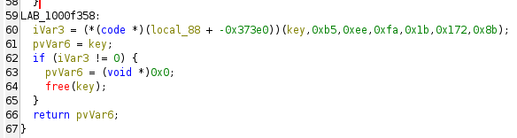
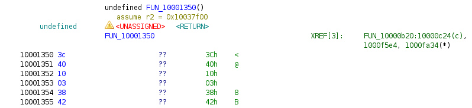
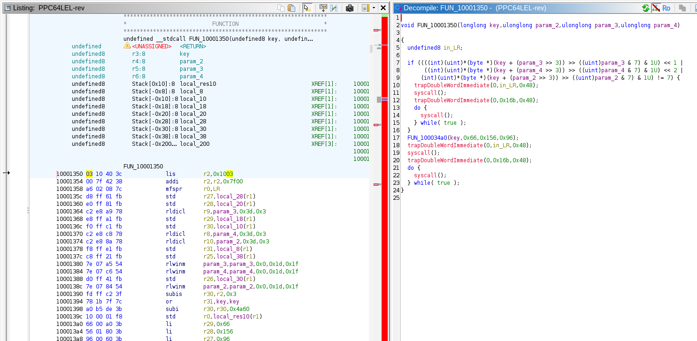
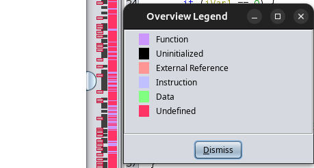
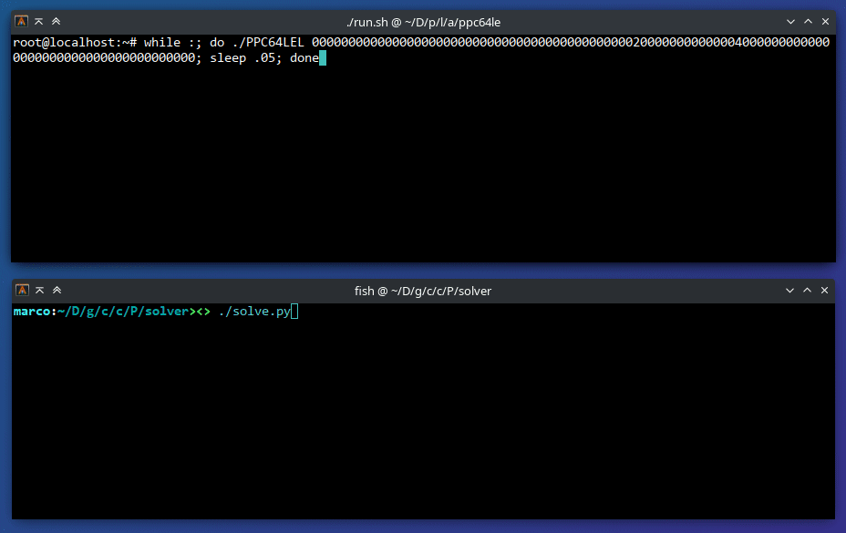

PPC64LEL
========

| Release date  | Event                   | Event kind | Category | Solve stats |
|:--------------|:------------------------|:-----------|:---------|:------------|
| July 19, 2025 | [ToH CTF 2025][ctftime] | Jeopardy   | rev      | 0/393       |

[ctftime]: https://ctftime.org/event/2833

> PPC64 rev in a CTF??? LEL.


Description
-----------

We are dealing with a Linux ELF executable for little-endian PowerPC 64-bit. The
README present in the challenge attachments gives us instructions to run the
program in `qemu-system-ppc64`, which will be helpful later.

Importing the file in our favorite disassembler/decompiler, we can find the
`main()` function to start reverse engineering. To find it, we can simply look
at the function list identified by the decompiler or check for xrefs to strings.

In `main()`, the program is checking that a key is supplied as the only
command-line argument. A function is then called to verify this key: if valid,
it is then hashed (Blake2b) and used for a ChaCha20 stream cipher
[libsodium](https://doc.libsodium.org/) to decrypt some hardcoded data in the
binary (presumably the flag).

Looking at the verifier function, which sits at `0x1000f258` for the original
binary released during ToH CTF 2025, we can see some simple preliminary checks
on the key format: it must consist of exactly 96 lowercase hexadecimal
characters, meaning 48 bytes of actual data.

The key is first decoded from hexadecimal to raw bytes, then things start to get
interesting: a function is called via `bctrl` to perform additional checks.
Reverse-engineering how these checks are performed is the whole point of the
challenge.


Solution
--------

The function called via `bctrl` does not appear cleanly in Ghidra:



Ghidra indeed has a hard time decompiling indirect calls that compute function
pointers via TOC (Table of Contents) because the `r2` register used for the TOC
base address is saved and restored from the stack (what a weird ABI, really).
Since we are not rich enough to afford the IDA Pro PPC64 decompiler, we will
have to do the hard work by hand.

The TOC base can be found looking at the initial setup of `r2` at the very start
of `main()`:

```none
10000860 03 10 40 3c    lis     r2,0x1003
10000864 00 7f 42 38    addi    r2,r2,0x7f00  # 0x10037f00
```

With some simple math, we now have the real address:
`0x10037f00 - 0x373e0 = 0x10000b20`.


### Simple Checks, Not so Simple Results

```c
/**
 * Called as: FUN_10000b20(key,0xb5,0xee,0xfa,0x1b,0x172,0x8b);
 */
void FUN_10000b20(byte *key, ulonglong param_2, ulonglong param_3,
                  ulonglong param_4, ulonglong param_5, ulonglong param_6,
                  ulonglong param_7)
{
  ulonglong uVar1;

  uVar1 = (ulonglong)key[param_5 >> 3];
  if ((((int)(uint)key[param_3 >> 3] >> ((uint)param_3 & 7) & 1U) << 1 |
       ((int)(uint)key[param_4 >> 3] >> ((uint)param_4 & 7) & 1U) << 2 |
       ((int)(uint)key[param_5 >> 3] >> ((uint)param_5 & 7) & 1U) << 3 |
       ((int)(uint)key[param_6 >> 3] >> ((uint)param_6 & 7) & 1U) << 4 |
       ((int)(uint)key[param_7 >> 3] >> ((uint)param_7 & 7) & 1U) << 5 |
      (int)(uint)key[param_2 >> 3] >> ((uint)param_2 & 7) & 1U) != 3) {
    FUN_10001350(key,0xd,0x112,0x69);
    FUN_10001700(key,0x14,0x165,0xa3,0xed,0x43,0x105);
    trapDoubleWordImmediate(0,uVar1,0x48);
    syscall();
    trapDoubleWordImmediate(0,0x16b,0x48);
    do {
      syscall();
    } while( true );
  }
  trapDoubleWordImmediate(0,uVar1,0x48);
  syscall();
  trapDoubleWordImmediate(0,0x16b,0x48);
  do {
    syscall();
  } while( true );
}
```

The code looks pretty weird, and it does not seem like Ghidra understood much
about it. The check however seems simple enough: it extracts 6 bits at some
given positions from the key, concatenates them, and checks them against a known
value (in this case `3`). The `if (... != 3)` branch then seems to call into two
other functions with similar signatures. However, looking at them, we can only
see invalid instructions:



Indeed, running the program in QEMU and supplying a dummy key, it will crash
trying to execute illegal instructions:

```none
root@localhost:~# ./PPC64LEL 000000000000000000000000000000000000000000000000000000000000000000000000000000000000000000000000
Illegal instruction
root@localhost:~# dmesg | grep PPC64LEL
[  105.310812] PPC64LEL[315]: illegal instruction (4) at 10001350 nip 10001350 lr 10000c28 code 1 in PPC64LEL[10000000+20000]
[  105.311227] PPC64LEL[315]: code: eba1ffe8 78630020 ebc1fff0 ebe1fff8 7c0803a6 4e800020 00000000 01000000
[  105.311260] PPC64LEL[315]: code: 00000900 60000000 60000000 60420000 <0310403c> 007f4238 a602087c d8ff61fb
```

The instruction pointer is exactly `0x10001350`, and the "code" also matches. We
can therefore only assume that the `if (... != 3)` must *not* pass, and we
should execute the code outside the `if` instead. This gives us 6 bits of key
(bits `0xb5` and `0xee` are `1`, while the other four are `0`).

```python
(1 << 0xb5 | 1 << 0xee).to_bytes(48, 'little').hex()
# -> '000000000000000000000000000000000000000000002000000000000040000000000000000000000000000000000000'
```

```none
root@localhost:~# ./PPC64LEL 000000000000000000000000000000000000000000002000000000000040000000000000000000000000000000000000
Illegal instruction
root@localhost:~# dmesg | grep PPC64LEL | tail -n3
[  584.196370] PPC64LEL[335]: illegal instruction (4) at 100034a0 nip 100034a0 lr 1000143c code 1 in PPC64LEL[10000000+20000]
[  584.196479] PPC64LEL[335]: code: 7889e8c2 5484077e 7c6348ae 7c632630 7c6318f8 786307e0 4e800020 00000000
[  584.196499] PPC64LEL[335]: code: 00000000 00000000 60000000 60420000 <0310403c> 007f4238 a602087c f0ffc1fb
```

This causes a crash at a different location, which confirms the first check
passed.


### `switch_endian(2)`???

So... **what exactly is going on with the rest of the code?** The decompiler
doesn't help much. We need to look at the disassembly. The negative branch of
the above `if` statement looks like this:

```none
                     LAB_10000fa0                       XREF[1]:     10000c00(j)
10000fa0 48 00 00 08    tdi        r0,0x48
10000fa4 2c 00 00 48    b          LAB_10000fd0
<...invalid insns...>
<...invalid insns...>
                     LAB_10000fd0                       XREF[1]:     10000fa4(j)
10000fd0 01 fe 21 f8    stdu       r1,local_200(r1)
10000fd4 6b 01 00 38    li         r0,0x16b
10000fd8 02 00 00 44    sc         0x0
10000fdc 48 00 00 08    tdi        r0,0x48
10000fe0 48 00 00 48    b          LAB_10001028
<...invalid insns...>
<...invalid insns...>
                     LAB_10001028                       XREF[2]:     10000fe0(j), 10001034(j)
10001028 01 00 60 38    li         key,0x1
1000102c ea 00 00 38    li         r0,0xea
10001030 02 00 00 44    sc         0x0
10001034 f4 ff ff 4b    b          LAB_10001028
<...invalid insns...>
<...invalid insns...>
```

The `tdi r0,0x48`, which should be more clearly disassembled as `tdi 0,r0,0x48`
(ffs Ghidra plz), is effectively a no-op. The subsequent `b` branches ahead to a
small piece of code that allocates space on the stack and performs the syscall
`0x16b` via the `sc` instruction. This corresponds to the very interesting
`switch_endian` syscall: a syscall that isn't documented, much less used
anywhere nowadays, but appears in kernel headers and
[some online syscall tables](https://syscalls.mebeim.net/?table=powerpc/64/ppc64/v6.14)
if we look hard enough.

Turns out that the engineers at AIM alliance were ingenious enough to design a
CPU capable of changing endianness at runtime through the toggling of a special
machine state register bit (only possible in supervisor mode, hence the
syscall).

What happens when endian is switched? Well, more or less what'd you expect:
anything the CPU reads/writes from/to memory is now interpreted as the opposite
endiannes. This includes instruction fetching: the first instruction after `sc`
is `0x08000048` i.e. `tdi 0,r0,0x48` in litle-endian mode, but becomes
`0x48000008` i.e. `b +8` in big-endian mode.

Therefore, even though it seems like we are immediately branching off into an
infinite loop that does `while(1) sys_exit(1);`, we are actually skipping that
single branch instruction to continue executing other big-endian code. This code
calls the same functions that are called inside the `if`, which now correctly
execute.

If we byte-swap the 32-bit instructions in `.text`:

```sh
powerpc64le-linux-gnu-objcopy -j .text --reverse-bytes=4 PPC64LEL PPC64LEL-rev
```

We can now see:

[](./writeup/byte-swapped.png)

After calling a big-endian function, the code switches back to the previous
endianness with another `switch_endian` syscall before continuing.


### Debugging

At this point, it should be clear that we are dealing with a good amount of
mixed little-endian and big-endian code. In fact, according to Ghidra, we have
interleaved chunks of instructions and data (i.e., unrecognized instructions)
scattered everywhere in the `.text` section of the original binary:



We are dealing with a tree of function calls where endianness may be switched
between each call. What if we want to debug the program while it's running to
see the actual code being executed, and what exactly is going on? We can do it,
as long as we are careful about endian switches.

QEMU user does not know about `switch_endian`, so we have to resort to QEMU
system. A simple Debian 12 PPC64LE image as shown in the handout README will
suffice. We can add `-gdb tcp::1234` to the QEMU command line to enable remote
GDB debugging and use `gdb-multiarch` to attach to it. Once in the GDB shell, we
can set a breakpoint to a known address of the binary, and we'll hit it as soon
as it's run (that is, given that there are no other binaries running at the same
address in the VM, but that's unlikely).

```sh
qemu-system-ppc64 \
    -machine pseries,x-vof=off \
    -nographic \
    -drive file=debian-12-nocloud-ppc64el-20250316-2053.qcow2,index=0,media=disk,format=qcow2 \
    -drive file=./PPC64LEL,index=1,media=disk,format=raw \
    -gdb tcp::1234

# In another shell
gdb-multiarch -ex 'target remote :1234' -ex 'b *0x10000fd8' -ex 'c'

# In the QEMU VM (note that the key is not all zeroes)
cat /dev/sdb > PPC64LEL
chmod +x PPC64LEL
./PPC64LEL 000000000000000000000000000000000000000000002000000000000040000000000000000000000000000000000000
```

The tricky part is that, if we put breakpoints into code that will later run in
a different endianness, we also need to explicitly tell GDB to change endianness
via `set endian {bit|little}`. For example, here:

```none
10000fd0 01 fe 21 f8    stdu       r1,local_200(r1)
10000fd4 6b 01 00 38    li         r0,0x16b
10000fd8 02 00 00 44    sc         0x0
10000fdc 48 00 00 08    tdi        r0,0x48
<...>
```

Single stepping past the `sc` instruction at `0x10000fd8` is not possible
because GDB will follow the VM into kernel space and step into syscall handler
code. A breakpoint for `0x10000fdc` can be inserted, but onece the syscall is
executed and the breakpoint is hit, all the registers will be in the wrong
endianness so we must tell GDB to explicitly switch endianness.

```none
(gdb) b *0x10000fdc
Breakpoint 1 at 0x10000fdc
(gdb) c
Continuing.

Program received signal SIGTRAP, Trace/breakpoint trap.
0xdc0f001000000000 in ?? ()
(gdb) x/i $pc
=> 0xdc0f001000000000:	Cannot access memory at address 0xdc0f001000000000
(gdb) set endian big
The target is set to big endian.
(gdb) x/i $pc
=> 0x10000fdc:	b       0x10000fe4
(gdb)
```


### Automation

We can keep playing around in the debugger or via manual byte-swapping, but
there are a bit too many endianness switches involved to do everything by hand
without losing our mind.

If we take a look at the little endian functions that are correctly identified
in Ghidra, we can start to understand how the whole thing works. A given
verifier function can call multiple other functions of different endianness in a
row, each time using the same pattern of `tdi 0,r0,0x48; b +X;` or
`b +8; <dummy insn>;` to perform an implicit test on the current endianness and
decide whether `switch_endian` should be called or not. If a check on the key
succeeds, the next functions are called in the right endianness, otherwise they
are called in the wrong endianness and everything crashes.

In any case, all the calls are performed indirectly via `bctrl` after moving the
function address into `ctr` and immediates for bit positions into parameter
registers. For example:

```none
10000c9c fd ff 42 3f    subis      r26,r2,0x3
10000ca0 14 00 a0 3b    li         r29,0x14
10000ca4 00 98 5a 3b    subi       r26,r26,0x6800
10000ca8 65 01 80 3b    li         r28,0x165
10000cac a3 00 60 3b    li         r27,0xa3
10000cb0 ed 00 20 3b    li         r25,0xed
10000cb4 43 00 00 3b    li         r24,0x43
10000cb8 05 01 e0 3a    li         r23,0x105
10000cbc 08 00 00 48    b          LAB_10000cc4
<...>
                     LAB_10000cc4
10000cc4 01 fe 21 f8    stdu       r1,local_200(r1)
10000cc8 78 bb e9 7e    or         param_7,r23,r23
10000ccc 78 c3 08 7f    or         param_6,r24,r24
10000cd0 78 cb 27 7f    or         param_5,r25,r25
10000cd4 78 db 66 7f    or         param_4,r27,r27
10000cd8 78 e3 85 7f    or         param_3,r28,r28
10000cdc 78 eb a4 7f    or         param_2,r29,r29
10000ce0 78 fb e3 7f    or         key,r31,r31
10000ce4 a6 03 49 7f    mtspr      CTR,r26
10000ce8 21 04 80 4e    bctrl
```

Each function checks between 1 and 6 bits of the key, and there are a lot
of functions. To automate analysis we have two main approaches:

1. Figure out a way to statically analyze the binary, recognizing and
   byte-swap big-endian instructions where needed, turning all code into
   little-endian. Once this is done, the program could theoretically be fed to
   a symbolic execution tool like [angr](https://angr.io/) to calculate the key,
   or even statically analyzed again to extract the key checks programmatically.

2. Run the program under GDB and figure out a way to identify the key check
   patterns, correctly switching endianness and extracting the key a few bits at
   a time. The one thing we must be careful with is the handling of
   the endianness seen by the debugger as discussed in the previous section.

Approach #2 involves writing something like a dumb homemade symbolic execution
engine, which seems more fun than #1, so that is what I went with (I also did
not want to lose my mind patching and realoading the binary into Ghidra 100
times, I'd much rather step through the actual running code via GDB).

We can create a Python GDB script that single-steps the program starting from a
given initial breakpoint, and decides what to do depending on the encountered
instructions:

- The `bctrl` instruction is always used to perform calls: when we encounter it,
  we can check the parameters in the registers to know which bits are going to
  be checked.
- The key bits are always accumulated into a single value and then checked
  either with `cmpwi` for multiple bits or `andi.` for single bits.
- The comparison is always followed by a `beq` or `bne` instruction.

There is a special case for leaf functions that do not call any other function
and return the result of the check to the caller. They can either:

- Check a single key bit and thus either return it as is or negate it via `not`
  before returning it.
- Check multiple key bits together: this is done via `xori` with the target
  value.


Complete Solution Scripts
-------------------------

Check out the full solution scripts in [`solver`](./solver). This is a lazy
implementation of the above approach. It consists of a main Python script that
assumes that the challenge binary is being run inside QEMU in a loop:

```sh
while :; do
    ./PPC64LEL aaaaaaaaaaaaaaaaaaaaaaaaaaaaaaaaaaaaaaaaaaaaaaaaaaaaaaaaaaaaaaaaaaaaaaaaaaaaaaaaaaaaaaaaaaaaaaaa
    sleep .05
done
```

With this assumption in mind, it does the following:

1. Starts with an empty guessed key of all zeroes.
2. Attaches GDB to QEMU inserting two breakpoints:
   - Breakpoint **A** right before the root verification function is invoked.
   - Breakpoint **B** at the last known branch after key bits are compared
     (initially the same as the first breakpoint).
3. When **A** is hit, the key in memory is replaced with the currently guessed
   one.
4. When **B** is hit, a `solve` command defined by a second GDB python script is
   invoked. This scipt:

   - Takes care of switching endianness as needed via `set endian` whenever `sc`
     is encountered to execute the `switch_endian` (363) syscall.
   - Identifies the interesting instructions (`bctrl`, `cmpwi`, `andi.` etc.)
     and extracts the bits and the value checked by the program.
   - Single steps the debugger until the next conditional branch (`beq`, `bne`)
     is encountered or until a trap for segfault or illegal instruction.
   - Returns this information to the caller script to update the guessed key
     value before next round.

Steps 2-4 are repeated in a loop, advancing breakpoint **B** and collecting a
few bits of information about the key each time, until the whole key is
extracted and a goal address is hit.

Here's a bonus GIF of the solver in action:


