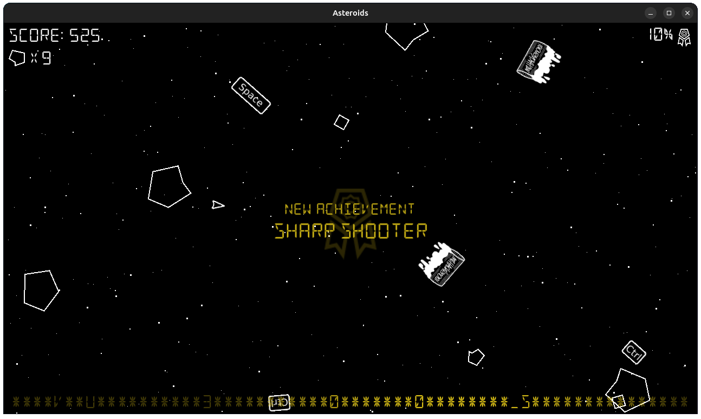
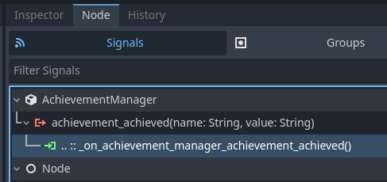

Asteroids
=========

| Release date     | Event                                    | Event kind | Category | Solve stats |
|:-----------------|:-----------------------------------------|:-----------|:---------|:------------|
| November 4, 2025 | [Ctrl+Space CTF][ctrl-space] Finals 2025 | Jeopardy   | rev      | 5/5         |

[ctrl-space]: https://ctrl-space.gg/

> I've been feeling nostalgic for old school retro games lately, so I have
> created my own Asteroids game. Wanna try and beat it?
>
> NOTE: flag format is non-standard, it must be enclosed in `space{...}` before
> submission.


Description
-----------

This reverse-engineering challenge consists of a remake of the famous 1979
[Asteroids](https://en.wikipedia.org/wiki/Asteroids_(video_game)) videogame,
built with [Godot Engine](https://godotengine.org/) as a Windows/Linux desktop
game.

[](writeup/achievement.png)

The game is distributed to players built for Linux in the form of an ELF plus
`.so` library and for Windows as an `.exe` plus `.dll` library. The shared
library called `libachievementmanager` is a native C++ GDExtension
([`src/asteroids-gdextension`](src/asteroids-gdextension)).

The goal of the game is to complete a series of hidden achievements, whose logic
is implemented in native C++ code in `libachievementmanager`. The achievements
perform various checks during the game and unlock pieces of the flag, which is
displayed at the bottom of the screen. The rest of the game logic is implemented
in various GDScript scripts ([`src/asteroids/scripts`](src/asteroids/scripts))
that are embedded in the game executable and interpreted by the Godot engine.

The player controls the spaceship with the mouse, using the pointer to direct
its laser shots, left click or CTRL to shoot, and right click or SPACE to thrust
forward. There are 3 different asteroid sizes: big, medium and small,
respectively worth 25, 50 and 100 points. Only big asteroids are spawned by the
game. Bullets that hit asteroids explode them into two smaller ones. Small
asteroids do not split further and are just eliminated on explosion.


Solution
--------

### Extracting the Game Project/Logic

GDScript scripts are easily extractable from a Godot game executable. Whether
they are embedded in the game as plaintext or as bytecode, they can be easily
decompiled back to their original source. The tool at
[`GDRETools/gdsdecomp`](https://github.com/GDRETools/gdsdecomp) can take a Godot
game executable (or `.pck` in case the game is not built as a single executable)
and extract everything as a Godot project directory. Coincidentally, that tool
is also built with Godot.

Once extracted, the project can be opened in the Godot editor where it can be
freely explored/modified/rebuilt. The only quirk is that the `libachievementmanager` shared library needs to be present in the right place in
order for Godot to succesfully run/export a new game build.

### Game Scripts

Once the Godot project is extracted, we can take a look at the scripts to
understand the game's logic. Some interesting GDScript scripts present in the
game are:

- `game.gd`: keeps track of global state like time, score, destroyed asteroid
  count, achievement progress, etc. It also handles sounds and global events
  like game over, asteroid explosion, and achievements.
- `player.gd`: represents the in-game spaceship, mainly handling its physics
  (movement), shooting, and most of the game's user input.
- `hud.gd`: holds text and controls visible on screen, like
  score/achievements/asteroids counters and flag at the bottom of the screen.
- `asteroid.gd`: represents asteroids spawned by the game and their physics.
- `bullet.gd`: represents laser bullets shot by the spaceship, handling their
  physics and collision with asteroids (causing them to explode).

The most interesting part among the various script is the achievement handling
in `game.gd`. Specifically, the `Game` class has a method registered to handle
the `achievement_achieved` signal, which is emitted by the `AchievementManager`
class. We can see this connection either in the [`game.tscn`](src/asteroids/scenes/game.tscn) scene file or in the editor GUI itself.

[](writeup/achievement_signal.png)

```none
[connection signal="achievement_achieved" from="AchievementManager" to="." method="_on_achievement_manager_achievement_achieved"]
```

The handler method looks like this:

```gdscript
func _on_achievement_manager_achievement_achieved(a_name: String, value: String) -> void:
    var new_flag = flag.text.split("")

    for i in min(value.length(), new_flag.size()):
        if value[i] != "*":
            new_flag[i] = value[i]

    flag.text = "".join(new_flag)
    hud.flash_new_achievement(a_name)
    achievement_sound.play()

    progress = 1.0 - (float(flag.text.count("*")) / flag.text.length())
    if progress == 1.0:
        trigger_game_over(true)
```

It's pretty clear that the key to solving the challenge is understanding how and
when is the `"achievement_achieved"` signal emitted by `AchievementManager`.

The only other interaction between game scripts and the native
`AchievementManager` class is on the setter of the game `score`, which notifies
the achievement manager each time the score changes invoking its
`.update_score()` method:

```gdbscript
var score = 0:
    set(val):
        score = val
        hud.score = val
        achievement_mgr.update_score(score)
```

### Native GDExtension Logic

To understand how everything works, the
[GDExtension](https://docs.godotengine.org/en/stable/tutorials/scripting/gdextension/index.html)
and
[godot-cpp](https://docs.godotengine.org/en/stable/tutorials/scripting/cpp/gdextension_cpp_example.html)
Godot documentation pages come in handy. In particular, they also contain
specific examples about building C++ GDExtensions.

The entry point for the `libachievementmanager` shared library is the function
`asteroids_lib_achievement_manager_init()` (also referenced in
[`bin/AchievementManager.gdextension`](src/asteroids/bin/AchievementManager.gdextension).
It registers an `init_module()` function that is then responsible for
initialization. This function registers the `AchievementManager` class and a
bunch of other classes. The following code is taken from IDA Free 8.4:

```cpp
void __fastcall init_module(int a1)
{
  if ( a1 == 2 )
  {
    godot::ClassDB::_register_class<asteroids::AchievementManager,false>(0LL, 1LL, 1LL);
    achievements_register_types();
  }
}

void achievements_register_types(void)
{
  godot::ClassDB::_register_class<asteroids::Achievement,false>(0LL, 1LL, 1LL);
  godot::ClassDB::_register_class<asteroids::Achievement01AsteroidSmasher,false>(0LL, 1LL, 1LL);
  godot::ClassDB::_register_class<asteroids::Achievement02AsteroidAnnihilator,false>(0LL, 1LL, 1LL);
  godot::ClassDB::_register_class<asteroids::Achievement03InterstellarCheater,false>(0LL, 1LL, 1LL);
  godot::ClassDB::_register_class<asteroids::Achievement04InterstellarHacker,false>(0LL, 1LL, 1LL);
  godot::ClassDB::_register_class<asteroids::Achievement05RookieNumbers,false>(0LL, 1LL, 1LL);
  godot::ClassDB::_register_class<asteroids::Achievement06Sharpshooter,false>(0LL, 1LL, 1LL);
  godot::ClassDB::_register_class<asteroids::Achievement07WarpSpeed,false>(0LL, 1LL, 1LL);
  godot::ClassDB::_register_class<asteroids::Achievement08Survivor,false>(0LL, 1LL, 1LL);
  godot::ClassDB::_register_class<asteroids::Achievement09Immortal,false>(0LL, 1LL, 1LL);
}
```

The `asteroids::` C++ namespace contains all the interesting code. We can filter
symbols defined under it like this:

```sh
nm --demangle libachievementmanager.linux.template_release.x86_64.so | rg asteroids::
```

### `AchievementManager`

The `AchievementManager::_bind_methods()` is invoked to register relevant class
methods to make them known to the game engine. In particular two methods called
`update_score()` and `_on_achievement_achieved()` are registered. The
`"achievement_achieved"` signal is also added via
`godot::ClassDB::add_signal()`.

The achievement classes, which we can reasonably assume represent one
achievement each, are all referenced in the `AchievementManager::_ready()`
method, called by the engine after instantiation, references all of these
classes and connects the `_on_achievement_achieved()` method to the `"achieved"`
signal of each class. The C++ bloat is a bit of a pain, but after a few variable
renames it does start to make sense:

```cpp
// ...
  *(_BYTE *)(achievement_cls + 24) = 0;
  *(_DWORD *)(achievement_cls + 28) = 0;
  *(_QWORD *)achievement_cls = (char *)&vtable for asteroids::Achievement01AsteroidSmasher + 16;
  godot::postinitialize_handler((godot *)achievement_cls, (godot::Wrapped *)callable);
  godot::StringName::StringName((godot::StringName *)&str_on_achievement_achieved, "_on_achievement_achieved", 0);
  godot::Callable::Callable((godot::Callable *)callable, this, (const godot::StringName *)&str_on_achievement_achieved);
  godot::StringName::StringName((godot::StringName *)str_achieve, "achieved", 0);
  godot::Object::connect(
    (godot::Object *)achievement_cls,
    (const godot::StringName *)str_achieve,
    (const godot::Callable *)callable,
    0);
// ...
```

All the `AchievementXXSomeName` classes are subclasses of
`asteroids::Achievement`, which is abstract. The virtual methods `get_name()`
and `achieve()` are implemented by each subclass.

The `achieve()` method does pretty much the same thing for all subclasses. It
takes a pointer and a length as parameters, then passes them to a function with
a randomized hexadecimal name that does some calculations. Looking at the
various `achieve()` method calls, we can infer that the first argument is a key
of some sort and the second one is its length. Sometimes, this key is static and
hardcoded in, but other times it is derived from game state. We can then assume
that a simple flag fragment decryption is taking place.

The `godot::Object::emit_signal_internal()` function is then used to emit the
`"achieved"` signal. The `AchievementManager` class then handles this signal in
`_on_achievement_achieved()` and re-emits it as `"achievement_achieved"`.

The game logic does not concern itself with any achievement classes nor the
`"achieved"` signal. The game only knows about `AchievementManager` and handles
the `"achievement_achieved"` signal.

The achievemen manager as well as all achievement classes are subclasses of
`godot::Node`. When the game starts, `AchievementManager` instantiates and adds
each achievement to its child nodes via `godot::Node::add_child()`.

As one might (or might not) know, depending on object type, a few methods are
automatically invoked by the Godot engine as needed. The
[Godot documentation](https://docs.godotengine.org/en/stable/classes/class_node.html)
lists and describes all of them. Among those, there are the following ones that
are implemented by some of the achievement classes:

- `_ready(void)`: called after class instantiation, after the node is added to
  the game tree. It can be used to initialize some internal state.
- `_process(double delta)`: called every single frame before rendering, where
  `delta` is the elapsed game time from the last call.
- `_physics_process(double delta)`: similar to `_process()`, but only called
  every time physics need updating, typically meaning at a fixed rate of 60
  times per second.
- `_input()`: called on user input (keyboard, mouse, etc).

These are the main methods through which achievement classes extract and keep
track of information about the game.

Additionally, as discussed above, the custom
`AchievementManager::update_score()` method is explicitly invoked by GDScript
game logic. This method simply forwards the score to all the child achievements
via a homonymous method.

```cpp
void __fastcall asteroids::AchievementManager::update_score(
        asteroids::AchievementManager *this,
        unsigned int new_score)
{
  char *v2; // rbx
  __int64 v3; // rbp
  char *i; // rbp
  __int64 obj; // rax
  __int64 achievement; // rax
  __int64 children; // [rsp+0h] [rbp-38h] BYREF
  unsigned __int64 v9; // [rsp+8h] [rbp-30h]

  v9 = __readfsqword(0x28u);
  godot::Node::get_children((godot::Node *)&children, (bool)this);
  v2 = (char *)godot::Array::ptrw((godot::Array *)&children);
  v3 = godot::Array::ptrw((godot::Array *)&children);
  for ( i = (char *)(v3 + 24 * godot::Array::size((godot::Array *)&children)); i != v2; v2 += 24 )
  {
    obj = godot::Variant::operator godot::Object *(v2);
    achievement = godot::Object::cast_to<asteroids::Achievement>(obj);
    if ( achievement )
      (*(void (__fastcall **)(__int64, _QWORD))(*(_QWORD *)achievement + 136LL))(achievement, new_score);
  }
  godot::Array::~Array((godot::Array *)&children);
}
```

### Achievements

Reverse-engineering and automatically extracting the logic of the decryption
routine invoked on `achieve()` to decrypt flag fragments takes a significant
amount of effort. The key passed to `achieve()` is the interesting thing, and
figuring that one out means understanding what each achievement wants.

After reverse-engineering achievement logic, there are two main ways to get the
flag and solve the challenge: force the needed values in the various class
methods (patching the shared library or at runtime via a debugger), or directly
change GDScript game logic to force the correct conditions and rebuild the game
(assuming it was successfully extracted to begin with).

As mentioned before, the interesting methods to look at for each achivement
class are `_ready()`, `_process()`, `_physics_process()`, `_input()` and
`update_score()`.

Here is a breakdown of the achievement's logic and checks:

1. `Achievement01AsteroidSmasher`: the method of interest here is
   `update_score()` as the others are not implemented.

   Since `update_score()` is called each time the score is updated, and the
   score is updated only when asteroids explode; it is simply used to count how
   many asteroids are exploded. Once 100 asteroids are exploded, the `achieve()`
   method is called (not too easy to spot because of the vtable indirection)
   passing a static key (`asteroids::Achievement01AsteroidSmasher::KEY`) and
   length as arguments.

2. `Achievement02AsteroidAnnihilator`: in this case the logic is similar, but
   the target number of asteroids is not a plain constant. Instead,
   `godot::String::num_int64()` transforms the number to string, and
   `godot::String::sha1_buffer()` calculates its SHA1 hash, which is then
   checked against a known value. When the hash matches, the SHA256 of the same
   stringified number is calculated and used as key for `achieve()`.

   Brute-forcing numbers from `0` upwards, calculating their SHA1 hash, we can
   find the number we need, which is 1160. Alternatively, we can simply use a
   debugger to bypass the score check in `update_score()`.

3. `Achievement03InterstellarCheater`: the method of interest is `_input()`. The
   logic is a bit more complex here. If the input event is a keyboard key press,
   its key code is extracted and checked against static values. This is a simple
   "cheat code" check, where the hardcoded static cheat code is `METEORITE`.

   The `achieve()` function is called again with a static key and size after
   the user types `METEORITE` on the keyboard while the game is running.

4. `Achievement04InterstellarHacker`: the `_input()` method of this class also
   checks for key presses. The cheat code here is, however, not plaintext.
   Instead, the input key codes are concatenated into a string up to a length of
   5, then the SHA1 hash of said string is calculated. Subsequent key presses
   cause a new character to be appended to the string, while the first character
   gets discarded, much like a ring buffer. Once the SHA1 matches with a static
   pre-calculated value, the SHA256 hash of the same string is calculated and
   used as key for `achieve()`.

   In this case, one can bruteforce the 5 character string checking the SHA1
   against the one in the binary. The cheat code this time is `ALIEN`.

5. `Achievement05RookieNumbers`: this achievemet also uses `update_score()`,
   this time checking the score itself against a fixed value. Once a score of
   50000 is reached, `achieve()` is called with a static key and size.

6. `Achievement06Sharpshooter`: `update_score()` is still the method of
   interest. The method keeps track of the last 9 score deltas, stored in an
   array used as ring buffer. Each invocation, it converts the array of scores
   into a Python-like string representation (`[1, 2, 3]`), calculates its SHA1
   hash, and checks it against a static value. When the hash matches, SHA256 is
   yet again used on the same string representation to calculate the key for
   `achieve()`.

   Given that asteroids are worth 25, 50 and 100 points respectively, based on
   size (large, medium, small), there are only 3<sup>8</sup> possible
   combinations. Brute-forcing them to get the right SHA1 gives
   `[25, 25, 25, 50, 50, 50, 100, 100, 100]` as the solution, meaning that the
   player needs to explode, in sequence: 3 big, 3 medium and 3 small asteroids.

7. `Achievement07WarpSpeed`: in the `_ready()` method, the player instance is
   retrieved and saved as class field via `godot::Node::get_node_or_null()`
   with `NodePath("/root/Game/Player")`. Then, in `_physics_process()` the
   player velocity as a 2D vector is retrieved via `player->get("velocity")` and
   its `.length()` (magnitude) is calculated. This value needs to stay above or
   equal to 300.

   The `double delta` argument is added to a class field to keep track of the
   amount of time that the player held a velocity of at least 300, resetting
   each time it drops below threshold.

   After 10 seconds keeping a velocity above 300, the achievement is granted via
   `achieve()` passing a static key.

8. `Achievement08Survivor`: this achievement also uses `_physics_process()` to
   keep track of total game time (since last death) adding up `delta` values.

   Each invocation, the elapsed time is truncated down to a 64-bit int,
   converted to string and hashed with SHA1. The static SHA1 to match this time
   corresponds to the hash of `"600"`, meaning that the player simply needs to
   survive 10 minutes. The SHA256 of the stringified time is then passed to
   `achieve()` in case of success.

9. `Achievement09Immortal`: exactly the same check as the previous achievement
   is implemented in `_physics_process()`, with the only difference being the
   amount of seconds needed. This time it's 3600 (1 hour).


So, to summarize, to unlock all the achievements and complete the game, the
requirements are:

- Destroy 1160 asteroids.
- Type the cheat code `METEORITE` and `ALIEN`.
- Reach a score of 50000.
- Destroy, in sequence: 3 big, 3 medium and 3 small asteroids.
- Maintain a speed of (modulus) 300 for 10 seconds.
- Survive for 1 hour.


## Solution Script

Since debugging/patching is also required, I did not automate everything with a
complete solution script that is able to extract the full flag by itself.
However, see the [`solve.py`](solve.py) Python script containing code to
bruteforce the various achievement-related SHA1 hashes.
