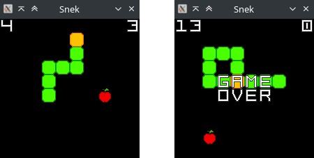
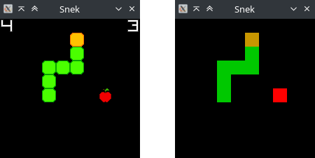
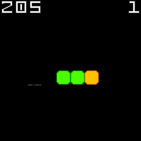

Snek
====

| Release date     | Event                              | Event kind | Category  | Solve stats |
|:-----------------|:-----------------------------------|:-----------|:----------|:------------|
| October 24, 2025 | [m0leCon CTF 2026 Teaser][ctftime] | Jeopardy   | pwn, misc | 33/638      |

[ctftime]: https://ctftime.org/event/2946

> Boy oh boy do I love me some retro gaming sessions of Snake. Unfortunately my
> Nokia 6110 recently fell from my balcony. It didn't break, but it punched a
> hole in the street and got lost into the city's sewer system, so I did what
> anyone else would have done in this situation: write my own remake of the
> videogame. Here, wanna take it for a spin?
>
> I've also integrated gaming session recording logic and I am hosting a server
> to upload replays! Send me yours and I shall take a look at it.
>
> ```
> nc snek.challs.m0lecon.it 28027
> ```


Description
-----------

The challenge consists of a Linux x86-64 ELF binary compiled with most modern
binary protections enabled (PIE, canaries, RelRO, etc), linked dynamically, but
not stripped. It implements a simple Snake video game clone using
[libSDL](https://www.libsdl.org/). The game functionality is easy to
reverse-engineer using any decent decompiler given that symbols for internal
functions and global variables are available.

[](writeup/screenshot.png)

The game starts with a 3-segment long "snek" (1 head and 2 body pieces) moving
in a 10x10 grid. Input is taken from the keyboard, using either WASD or arrow
keys to control the direction of the snek head. It is only possible to perform
90-degree turns. If the snek goes out of the screen, its head will wrap arond
and appear from the opposite side, continuing in the same direction. If at any
time the snek head touches one piece of its body, one life is lost and the game
resets. When 3 lives are lost the game is over.

Apples are "spawned" by the game using the `rand()` libc funcion to determine
their coordinates on the 10x10 game grid, but no call to `srand()` is performed,
meaning that the apple positions are completely deterministic.

The game accepts a few options to run locally:

```none
snek: Usage: ./snek [--help] [--scale N] [{--record|--replay|--fast-replay} replay.txt]
```

Aside from scaling the display size with `--scale`, the other interesting
options are `--record` and `--replay`. In fact, the game implements a recording
functionality that writes out a text file, which can be later used to replay the
exact moves that were recorded.

The replay file simply contains the sequence of moves performed (`WASD`
characters) and dots (`.`) when a step is made without user input (no change in
direction). It can be crafted by hand or generated with the `--record` option.
The `--replay` option replays the moves in the given file one by one, instead of
reading user keyboard input. The game screen is normally updated, but at a much
faster speed. The `--fast-replay` option only updates the screen after the whole
replay file is parsed and emulated.

Internally, the "snek" itself is represented internally as a global `snek` array
in the `.data` section of the binary. This array consists of 100 pairs of 16-bit
unsigned integers, with the head at index 0. Another global `snek_length`
variable, starting at `3` on game reset, is used to keep track of the actual
length.

Among the distributed files, there is also a `textures` directory holding
different binary files that contain raw pixel data: their content is loaded by
the game and used to initialize SDL textures and display them on screen. Namely,
the textures are for the snek body pieces, the snek head, apples that the snek
can eat, a few letters, and decimal numbers.

Information about textures is also stored in `.data`, in a `texture_info[]`
array of C structs. Each struct contains the information needed to load one
texture: pixel data file path, pixel format, pixel size, blend mode, and
fallback color. This can be deduced by looking up online documentation for the
libSDL functions being used.

Textures are loaded via `SDL_CreateTexture()` on game initialization and on game
reset in the `load_textures()` function. Textures are all assumed to be 20x20
pixels in size. The fallback color is used in case the pixel data file for the
texture is not found or can't be opened:

[](writeup/texture-fallback.png)

Finally, the game also implements a "screenshot" functionality that is
automatically triggered either on game over or when the provided replay file is
exhausted. This exports the contents of the game screen as a PNG image to
`/tmp/snek.png`.

Remotely, a [`server.py`](src/game/server.py) Python script implements a simple
TCP server that accepts a replay as input, runs the game in headless mode (via
`--fast-replay` plus `SDL_VIDEODRIVER=dummy`), and lets the user download the
PNG screenshot of the final game state.

No other input is possible remotely other than the provided replay, nor is it
possible to get any output from the game itself except for the final screenshot.


Bugs
----

As said above, the snek itself is merely a global array of 100 structs of the
form `struct vec2 { uint16_t x, y; };`. The current travel direction, as well as
the apple position, are also stored as global `vec2` variables.

The function responsible for updating the snek position is `snek_step()`, and
the one responsible for drawing the snek itself on screen is `draw_snek()`. Here
they are decompiled via IDA Free 8.4:

```c
void snek_step(void)
{
    unsigned int i; // [rsp+8h] [rbp-8h]
    vec2 new_head; // [rsp+Ch] [rbp-4h]

    new_head.x = snek[0].x + snek_direction.x;
    new_head.y = snek[0].y + snek_direction.y;

    if ( __PAIR32__(
            (unsigned __int16)(snek[0].y + snek_direction.y) % 0xAu,
            (unsigned __int16)(snek[0].x + snek_direction.x) % 0xAu) == apple )
    {
        // Collision with apple
        memmove(&word_6044, snek, 4LL * (unsigned int)snek_length);
        snek[0] = new_head;
        ++snek_length;
        ++game_score;
        apple_move();
    }
    else
    {
        // No collision with apple
        memmove(&word_6044, snek, 4LL * (unsigned int)(snek_length - 1));
        snek[0] = new_head;
    }

    // Collision check between new head and rest of snek body
    for ( i = 1; i < snek_length; ++i )
    {
        if ( __PAIR32__(snek[i].y, snek[i].x) == new_head )
        {
            if ( --snek_lives )
                game_init();
            else
                game_over = 1;
        }
    }
}

void __fastcall draw_snek(void)
{
    unsigned int i; // [rsp+Ch] [rbp-4h]

    for ( i = 1; i < snek_length; ++i )
        draw_texture(snek[i].x % 0xAu, snek[i].y % 0xAu, qword_66F0); // body
    draw_texture(snek[0].x % 0xAu, snek[0].y % 0xAu, qword_66E8);     // head
}
```

The first bug is in the missing handling of wrap-around in the collision
detection logic between the snek's head and the rest of its body.

As we can see, the XY coordinates stored in the `snek` array are updated with a
simple component-wise sum of the `snek_direction` vector. The wrap-around logic,
in the form of a modulo (`%`) operation, is only applied when checking for apple
collision in `snek_step()` and when drawing the snek pieces on screen. It is
*not* applied when checking collision between the head and body parts. This
means that, after wrapping around the screen at least once, even though visually
the snek's head can overlap with other pieces of its body that have not yet
wrapped around, *no collision is detected between the two*. Collision is also
never considered between different body parts, so they can very well overlap
each other.

Playing around with the game for a little while, it's also easy to notice some
wrap-around inconsistencies. Moving left (direction `x=-1, y=0`), if the head is
at `x=0, y=*` its new position will be `x=65535, y=*`, and the simple modulo
operation applied at draw time will result in the head being drawn at column 5
(`65535 % 10`) instead of 9. The same applies when moving up
(direction `x=0, y=-1`) with head at `x=*, y=0`.

So far, this wrap-around logic merely results in visual inconsistencies on the
game screen, but we can go further.

Normally, it would be impossible to continue eating apples after the snek
reaches a length of 10x10 = 100 pieces, because the screen would be filled with
the snek. However, the `apple_move()` function does not implement logic to
"remove" the apple from the game. In case the whole grid is filled, the apple
stays in place (covered by the snek body because it is drawn above, but still
there). The snek head can then circle back and "eat" the apple again, even
though it technically already occupies the entire grid with its body.

Furthermore, because of the buggy collision detection, multiple snek segments
can have visually overlapping grid positions on screen, which are the same
positions used to calculate available places for the apple (`apple_move()` does
account for wrap-around). This makes it possible for the apple to keep moving
around even if the snek reaches a length above 100 pieces, as long as there are
visually free grid cells.

The global `snek[]` array sized based on the assumption that exceeding 100
pieces should be impossible. **However**, because of the buggy collision
detection coupled with apple movement logic, the snek can grow indefinitely and
exceed a length of 100. This causes a linear buffer overflow outside the
`snek[]` array in the `.data` section, which can corrupt data past it.

Lastly, another "bug" present in the program, if we want to call it that, is the
wrong error checking around `fread()` when trying to read texture pixel data.
Even though a file with incorrect size is opened, the program merely ensures
that `fread()` does not return zero, while it should make sure that all the
requested bytes were read.


Solution
--------

Given that we can overflow the global `snek[]` array, anything past it can be
overridden with coordinates: 4 bytes per snek body piece, 2 for the X coordinate
and 2 for the Y.

As it turns out, right past `snek[]` we have the global `texture_info[]` array,
containing information to load textures, among which their pixel data file
paths.

```none
.data:0000000000006030                 align 20h
.data:0000000000006040 ; vec2 snek[100]
.data:0000000000006040 snek            vec2 <6, 5>             ; DATA XREF: apple_move+3F↑o
.data:0000000000006040                                         ; snek_init+20↑w ...
.data:0000000000006044                 vec2 <5, 5>
.data:0000000000006048                 vec2 <4, 5>
.data:000000000000604C                 vec2 61h dup(<0>)
.data:00000000000061D0                 dq 0
.data:00000000000061D8                 dq 0
.data:00000000000061E0 ; TextureInfo texture_info[22]
.data:00000000000061E0 texture_info    db 'textures/apple.bin',0
.data:00000000000061E0                                         ; DATA XREF: load_textures+24↑o
.data:00000000000061E0                                         ; load_textures+A6↑o
.data:00000000000061F3                 align 20h
.data:0000000000006200 unk_6200        db    3                 ; DATA XREF: load_textures+45↑o
```

With a snek length of 105 (`(0x61E0 - 0x6040) / 4 + 1`), the last body piece
will overwrite the first 4 bytes of the path for the first texture's pixel data
(used to draw the apple). With a length of 106, the last two body pieces will
overwrite the first 8 bytes of the path, and so on.

Since textures are loaded every time the game resets (function `load_textures()`
called by `game_init()`), overwriting this path can cause the program to load
the contents of an arbitrary file as pixel data for the texture. This data would
be interpreted as 24bit RGB pixel data when loading the texture (the apple
texture uses `SDL_PIXELFORMAT_RGB24`) *and also appear on the screen and in the
final game screenshot*, effectively leaking the contents of whatever file was
loaded.

The goal is therefore to overwrite the pixel data file path for the apple
texture with `"flag\x00"` by running the game with a replay file containing the
right, precisely crafted moves.

We cannot write the full path in one shot, because it is 5 bytes long (including
the NUL string terminator), meaning that we would need two snek body pieces with
arbitrary XY coordinates. Two consecutive body pieces cannot however have
coordinates with components that differ more than 1, as they follow each other
one right after the other when moving. When the snek dies though, the game is
reset and its length is set back to 3. We can therefore use two lives to
overwrite 8 bytes of texture path with arbitrary values: the first life to
overwrite bytes 4-7, and the second to overwrite bytes 0-3.

In order to grow to a decent length, we can simply "sweep" the entire grid a few
time collecting apples along the way, then do some precise movements to eat the
final few apples, as their position is deterministic.

The solution is therefore as follows:

1. Get the snek to a decent length near 106 by sweeping the grid. Wrap around at
   least once while doing so to avoid collisions.
2. After reaching length 106, move the head to `x=0, y=*`.
3. Die exactly 105 steps later, when the last piece of the body is at `x=0`. To
   make it simple, one can just wait 102 steps going straight, then circle the
   head on top of the body in 3 moves (e.g. `DSW` if going up). The game resets.
   The apple texture fails to load because its pixel data path is now
   `"text\x00\x00[...]"` and the apple is drawn as a red square.
4. Perform the same sweeping and get to length 105.
5. After reaching length 105, move the head until its coordinates encode
   `"flag"`, that is `x=0x6c66, y=0x6761`.
6. Die exactly 104 steps later, when the last piece of the body is at
   `x=0x6c66, y=0x6761`. The game resets. The apple texture pixel data is now
   loaded from the `"flag"` file.

The resulting final screenshot should look something like this:

[](writeup/flag.png)

The PNG screenshot can then be opened with any image processing library to
access the raw pixel data and recover the flag's content. The complete exploit
linked below does this with [Pillow](https://pypi.org/project/pillow/).


Complete Exploit
----------------

The [`expl.txt`](./expl.txt) file contains the full replay file needed for
exploitation. Providing this to the game will result in a final `/tmp/snek.png`
screenshot that embeds the flag (as shown above).

The [`expl.py`](./expl.py) file is an automated exploit script that also
extracts the flag from the final screenshot. It requires some external modules
to run: `pip install -r expl_requirements.txt`.

```shell
# Provide input by hand
cd src/game && ./snek --fast-replay ../../expl.txt

# OR run expl script with local game executable
./expl.py src/game/snek

# OR run expl script connecting to local/remote server
HOST=example.it PORT=1234 ./expl.py src/game/snek REMOTE
```
